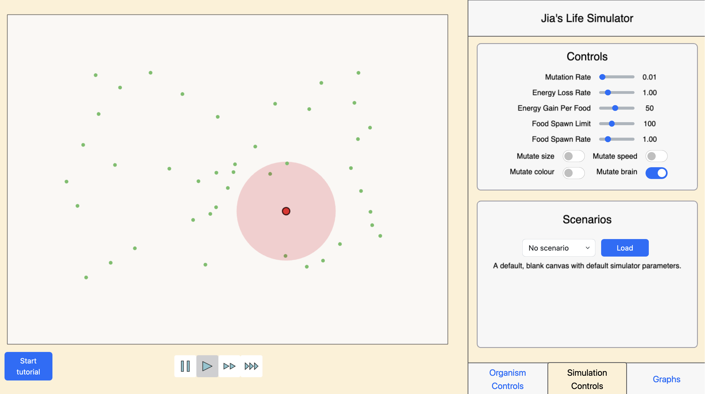

# Artificial Life Simulator


This project is a browser-based life simulator that features complex simulation mechanics that are user customisable. Organisms can have neural networks that evolve across generations, leading to some interesting behaviours. The webpage loads in one second and has a Google Lighthouse performance score of 95, which corresponds to a ‘Good’ rating. It also supports up to 200 organisms at once while running at 30x real-time speed.

## Getting Started
Visit [jqpoon.com/life](http://jqpoon.com/life) or run it locally with
```
npm install
npm run dev
```
